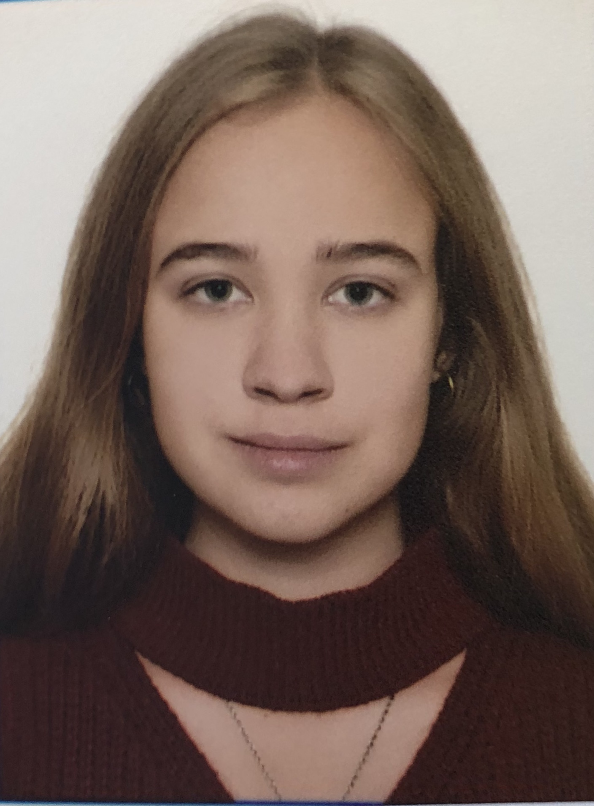

[english-for-designers](../README.md)

# About me 👋

I’m Daria Tolkachova, a graphic designer with a love for branding, posters, and visual depth. I create logos and visual systems, and I use 3D as a tool to add character and dimension to brands.

I like to really feel a project, I often think about an idea for a long time until it turns into a clear visual concept. I enjoy experimenting, but structure and meaning are always important to me.

I used to play bass guitar in a band, which is probably why rhythm and balance matter so much to me, both in music and in design.

I want to keep developing as a designer, exploring new tools and ideas, and constantly raising my own standards. Design is a field that never stands still, and I want to grow with it.

