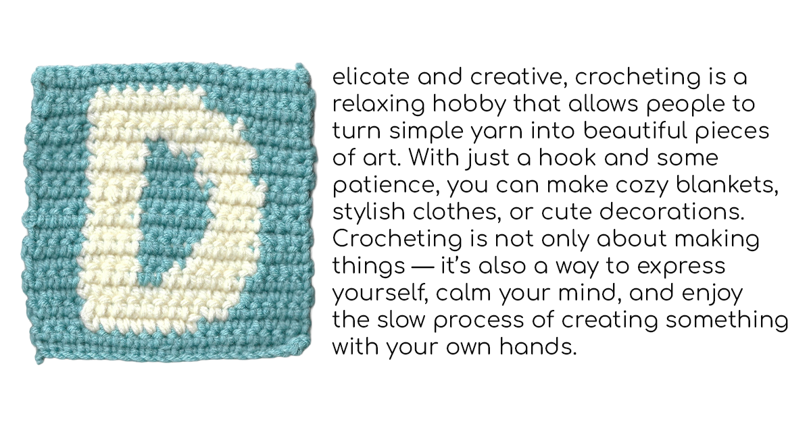

[english-for-designers](../README.md)

# Alt Text

I wrote two of my own versions of alt text, and I also used artificial intelligence to generate two additional versions.

**My versions:**

* A knitted blue square with a white letter D.

* A knitted yarn square with a blue background and a white letter D.

**AI versions:**

* A crocheted square with a white letter “D” on a light blue background.

* A handmade crocheted square with a white letter “D” stitched into a light blue background, photographed on a neutral surface.

**Type Specimen**

I wrote a short text to express my personal relationship with my hobby.

