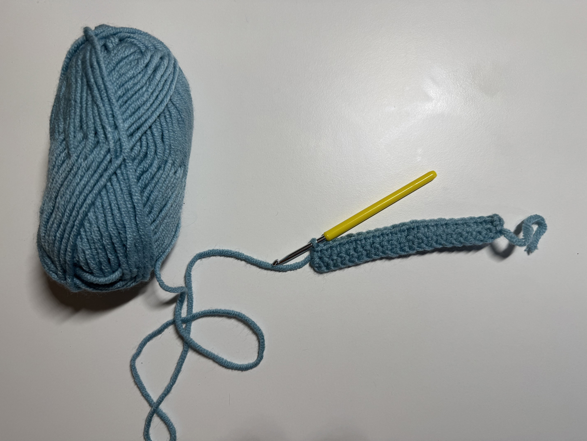
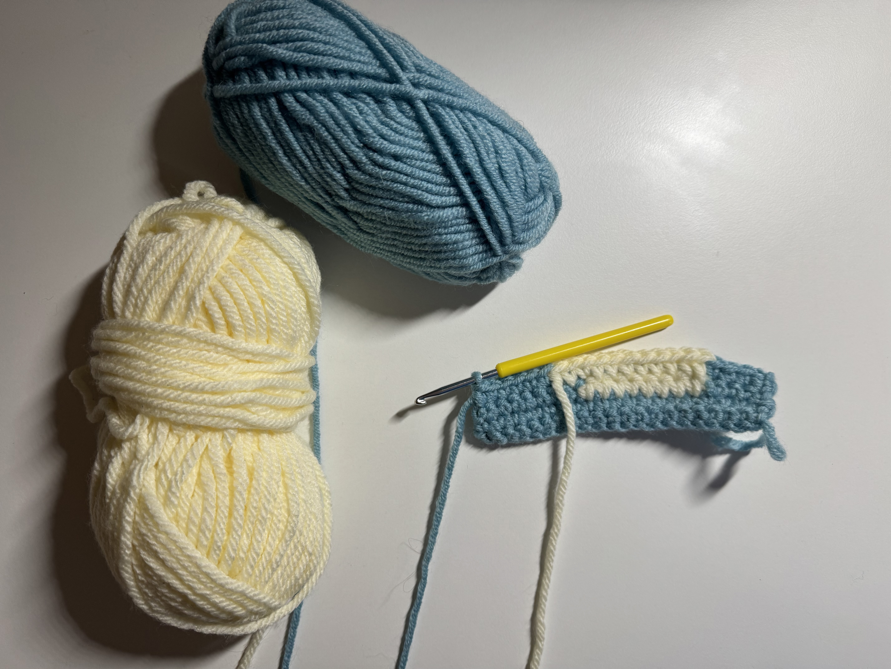
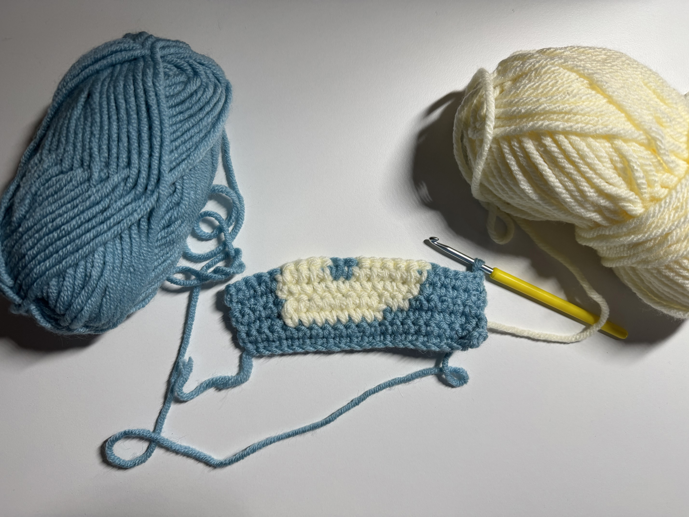
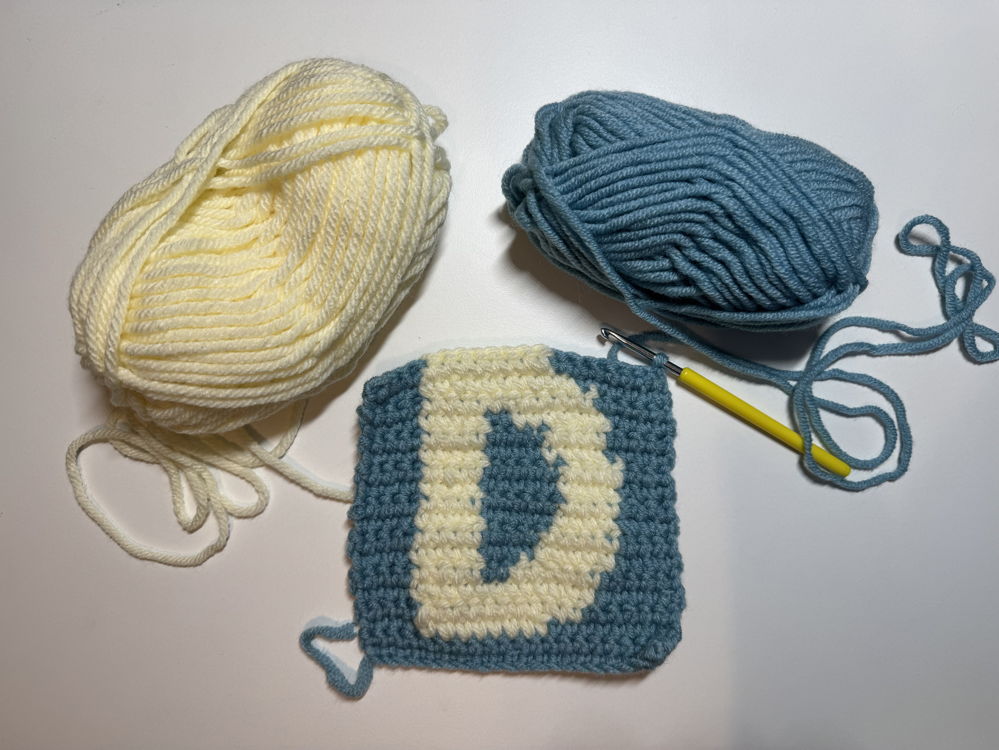
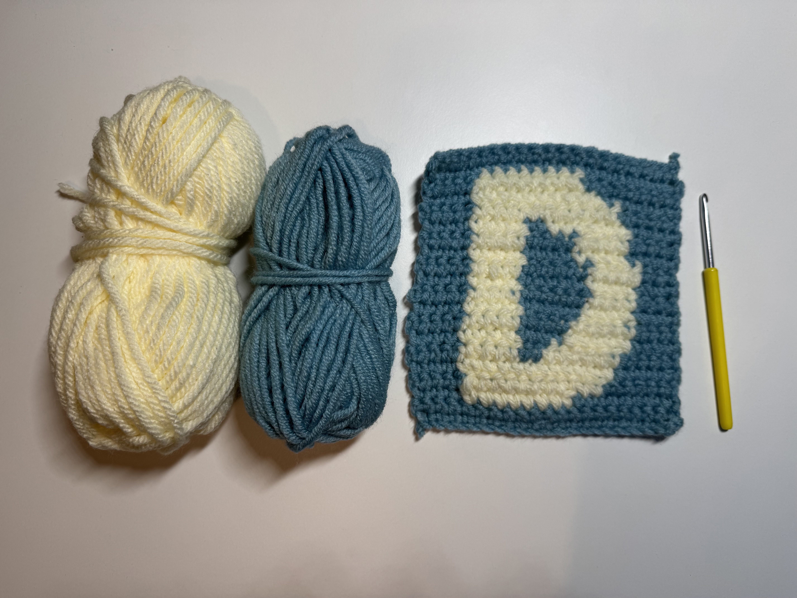
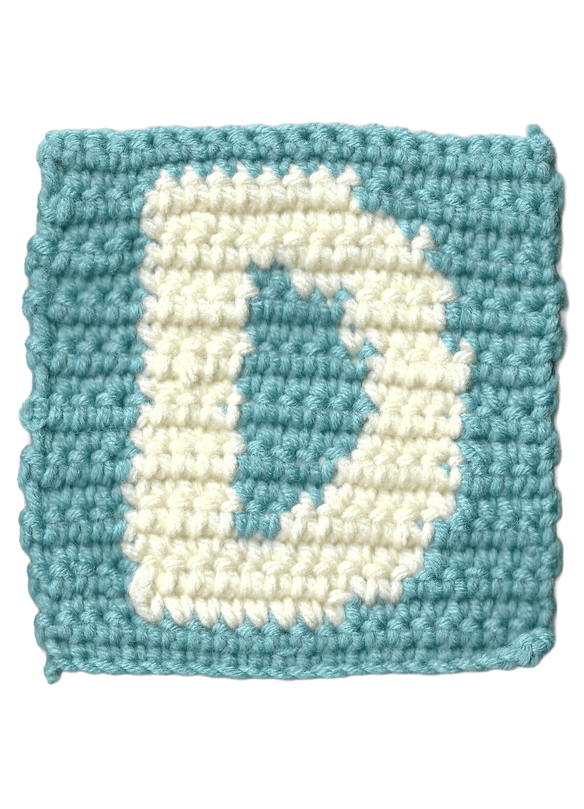

[english-for-designers](../README.md)

# Bespoke character

Our task was to create a stylized letter.

**Main idea:** I chose the letter **D** because it is the first letter of the word *design* and also the first letter of my name. Since I enjoy knitting in my free time, I decided to create a classic knitted square made of yarn.

Below you can see the working process:

**Result:**

