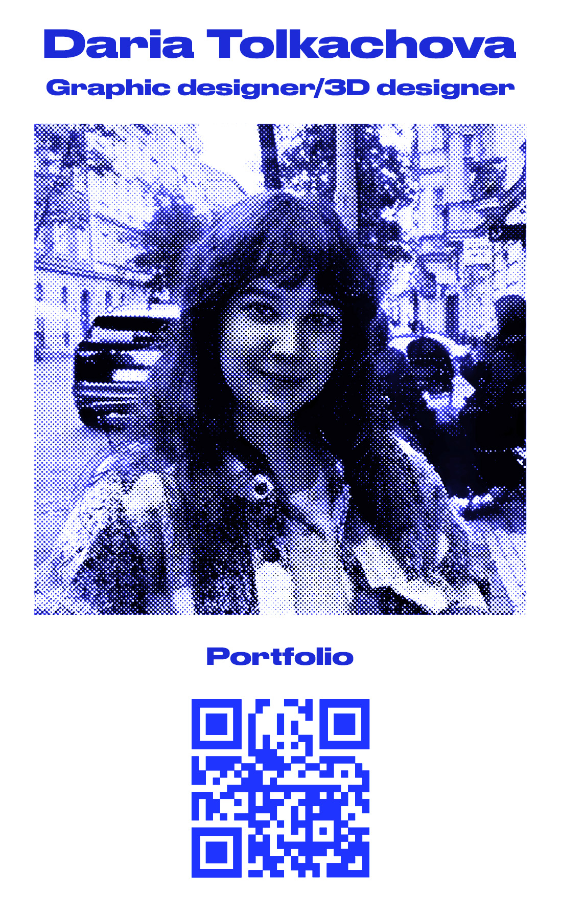
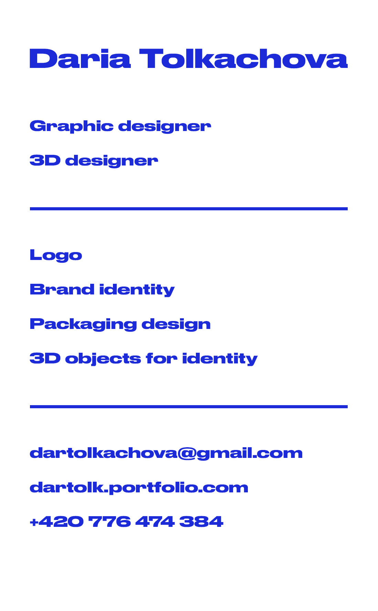

[english-for-designers](../README.md)

# Business card

As part of this assignment, I created a new version of my business card. The goal was to turn the card sketch into a short and clear text introduction (“handshake”): who I am, what I do, my approach to work, and how to contact me. It was important that the text was concise, easy to understand, and accurate.

P.S. Unfortunately, I don’t have a sketch of my business card, so I created a preliminary final version.

**My business card:**

