[english-for-designers](../README.md)

# 1. Project Overview

**Pekárna Kabát — Brand Redesign & Visual Identity**

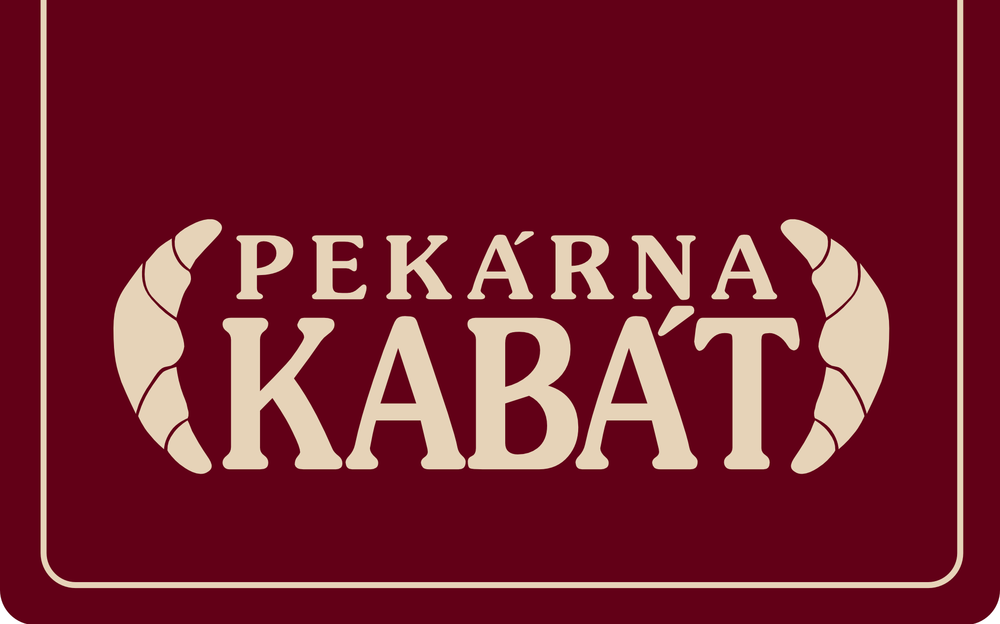

Pekárna Kabát is a traditional Czech bakery brand with a long local history and strong emotional connection to its customers.

- The goal of the redesign was to modernize the bakery’s visual identity while preserving its heritage, authenticity, and emotional value.

- The project focuses on the idea of generational memory — people who grew up with the bakery’s products now return with their own families, continuing a tradition connected to taste, routine, and nostalgia.

- The redesign also aimed to create a stronger visual distinction from competitors such as Ječmínek and Libeřské lahůdky through a bold and recognizable contemporary identity.

# 2. The Challenge

The previous visual identity lacked a modern concept and did not fully convey the emotional value of the brand’s history, even though the design reflected the value of tradition

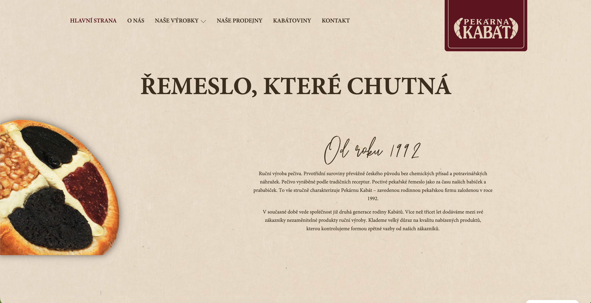

Main challenges included:

- modernizing the identity without losing authenticity,
- creating a memorable and recognizable visual language,
- building stronger emotional storytelling,
- differentiating the brand from visually similar competitors.

The redesign needed to feel both nostalgic and current — familiar for long-term customers while attractive to a younger audience.

# 3. My Role

I worked independently on the project from research to final execution.

My responsibilities included:

- brand analysis,
- competitor research,
- visual strategy creation,
- logo redesign,
- typography selection,
- color palette development,
- packaging design,
- posters,
- mockup preparation,
- presentation of the final visual identity system.

# 3. Competitor Analysis

The redesign aimed to differentiate 

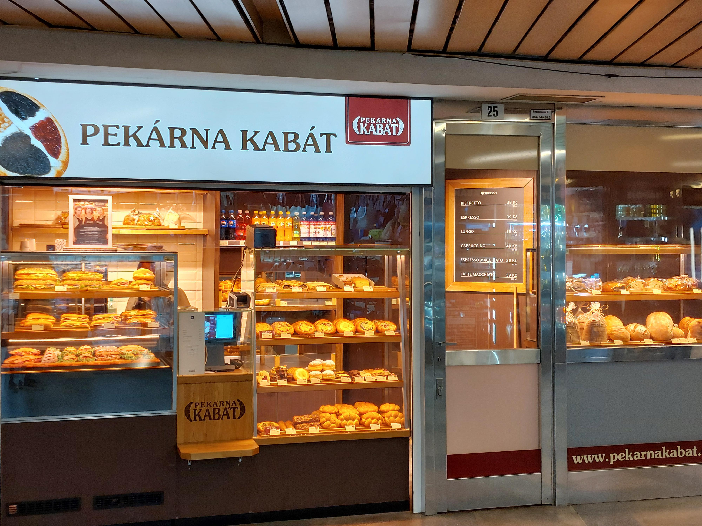

Pekárna Kabát 

from local competitors such as 

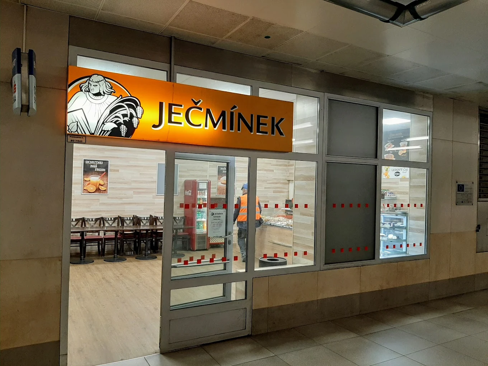

Ječmínek and 

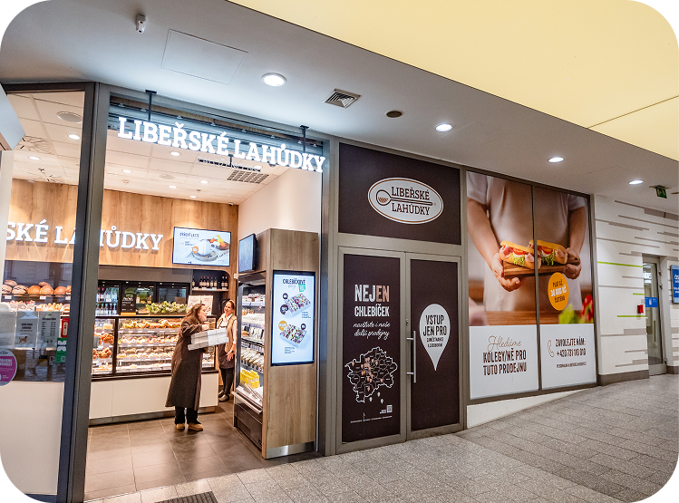

Libeřské lahůdky.

Many bakery brands in the region use visually similar identities based on traditional rustic aesthetics, warm color palettes, and generic bakery visuals. As a result, the brands often feel visually interchangeable and lack strong recognition.

Another challenge was the physical presence of Pekárna Kabát locations. Many of the bakeries are situated in busy urban environments or in metro,

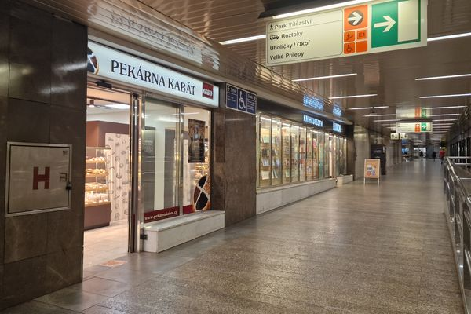

where the original identity blended into the surrounding visual noise and became less noticeable.

The redesign therefore focused on creating a bold and recognizable visual system that would:

- stand out in public space,
- improve brand memorability,
- create stronger emotional communication,
- and visually separate the bakery from competitors.

# 4. Concept & Brand Strategy

The core concept of the redesign is based on the emotional relationship between people and food memories.

The bakery is presented not only as a place that sells pastries, but as part of everyday life and family tradition.

The visual identity reflects the idea that customers have known these flavors since childhood and now continue sharing them with future generations.

The strategy focused on:

- emotional storytelling,
- human-centered communication,
- connection between tradition and modernity,
- strong visual memorability,
- creating warmth through graphic design.

The slogan (Přesně to, co potřebujete- Just what you need) and visual atmosphere support the idea of comfort, familiarity, and continuity.

# 5. Visual Identity

The visual system combines minimalist contemporary design with nostalgic references inspired by traditional bakery culture.

The identity is built around:

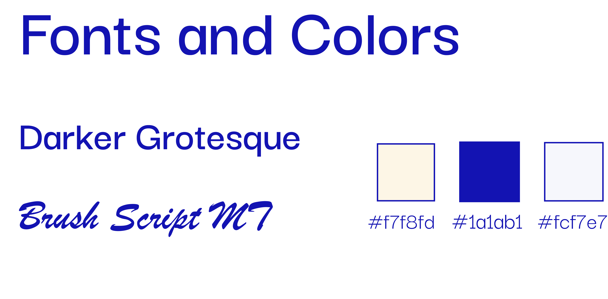

- bold blue color accents,
- cream background tones,
- expressive typography,
- archival-inspired photography,
- graphic simplicity with emotional character.

The strong blue palette was intentionally chosen to differentiate the bakery from typical warm-toned bakery branding used by competitors.

The result is a recognizable and modern visual language that still feels authentic and personal.

# 6. Logo Redesign

I wanted the logo to reflect the value of tradition, so I decided to combine traditional Czech embroidery elements with Czech pastries, resulting in a minimalist design element

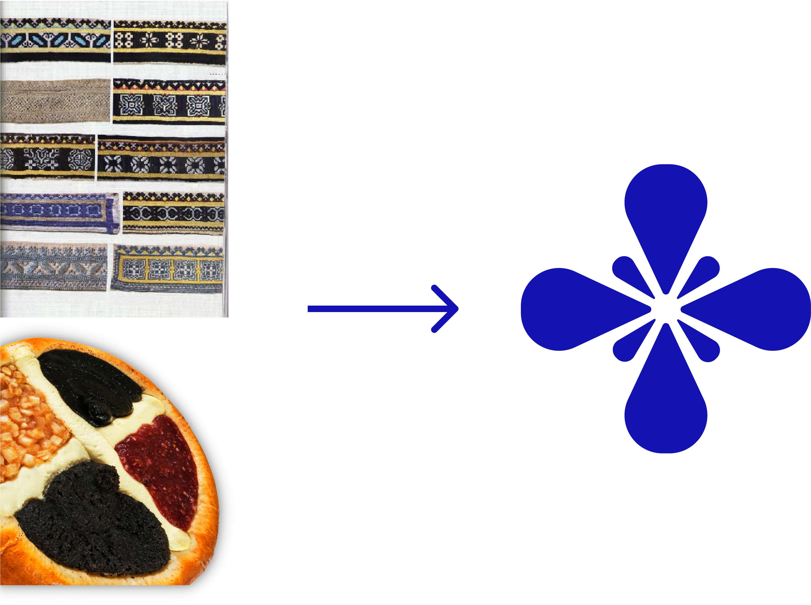

The new logo combines:

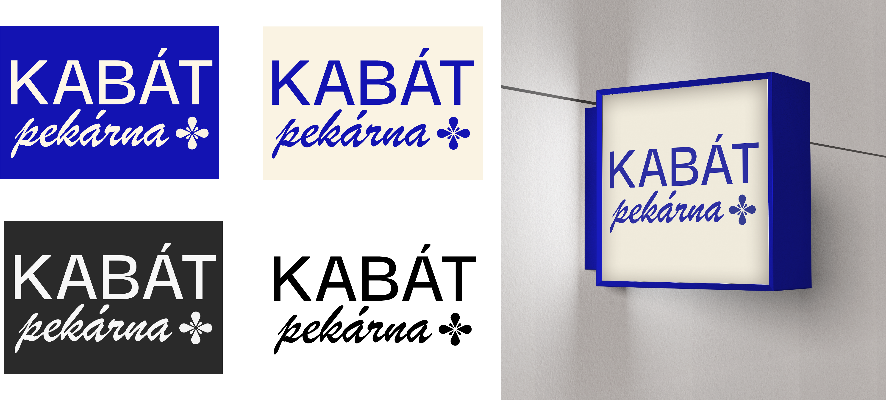

- bold uppercase typography,
- handwritten script,
- simplified decorative elements.

This balance helps the identity feel both contemporary and personal while remaining adaptable across different applications.

# 7. Packaging Design

The packaging system was designed to unify different product categories under one recognizable visual identity.

The redesign included:

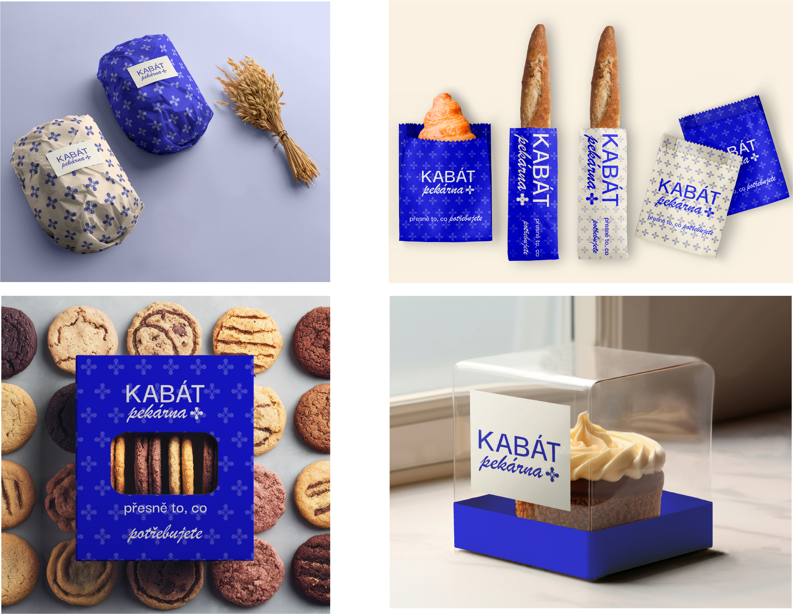

- pastry packaging,
- bread bags,
- cookie boxes,
- dessert packaging.

The bold contrast, patterns, and typography create strong visibility while making the packaging feel modern, memorable, and emotionally connected to the brand.

# 9. Posters

The poster series was created to attract attention in public spaces and strengthen the emotional side of the brand.

The visuals combine:

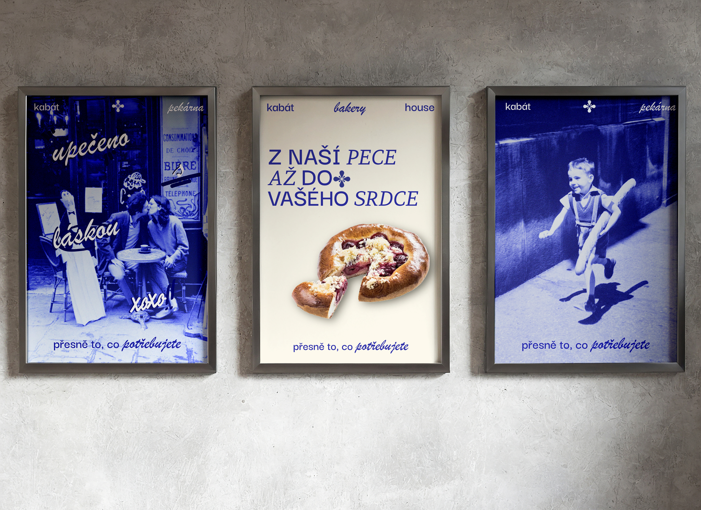

- documentary-style photography,
- nostalgic everyday moments,
- graphic overlays,
- human-centered storytelling.

Instead of focusing only on products, the campaign highlights people and memories connected to the bakery experience.

# 10. Final Outcome

The redesign transforms Pekárna Kabát into a contemporary bakery brand that preserves its history while building a stronger emotional and visual connection with modern audiences.

Through a bold visual system and human-centered storytelling, the new identity helps the bakery stand out within a competitive environment while remaining authentic to its heritage.