[english-for-designers](../README.md)

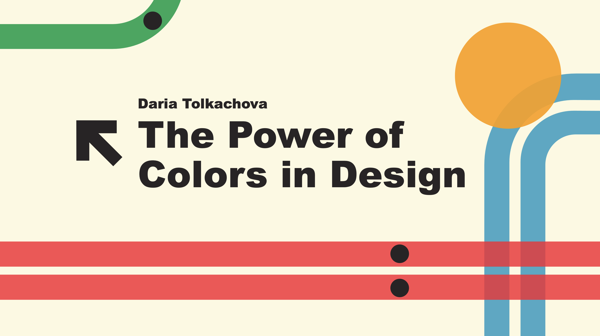

As we know design is all around us every day, it's advertisements, banners, websites, packaging and atc.
But first of all we notice the colors, and then we read the message that the design is trying to convey to us.
Colors are not just for decoration; they have meaning, create emotions, and influence our decisions. Designers use colors to send messages, create moods, and attract attention.

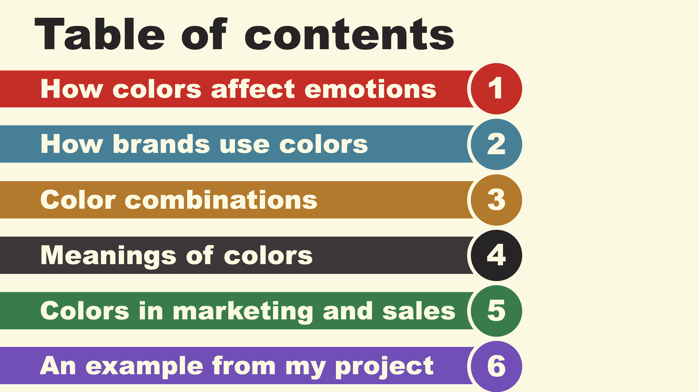

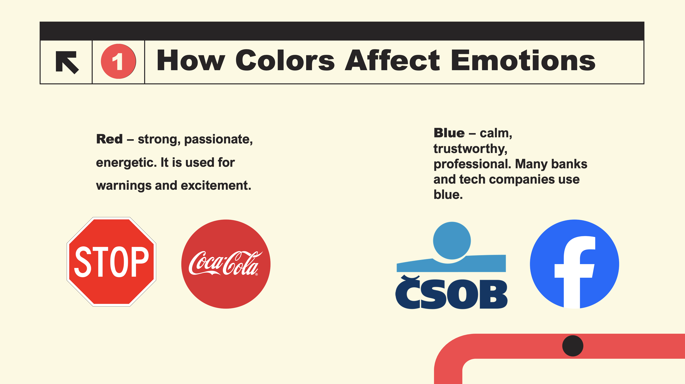

Colors can make us feel happy, sad, excited, or calm. Here are some examples:

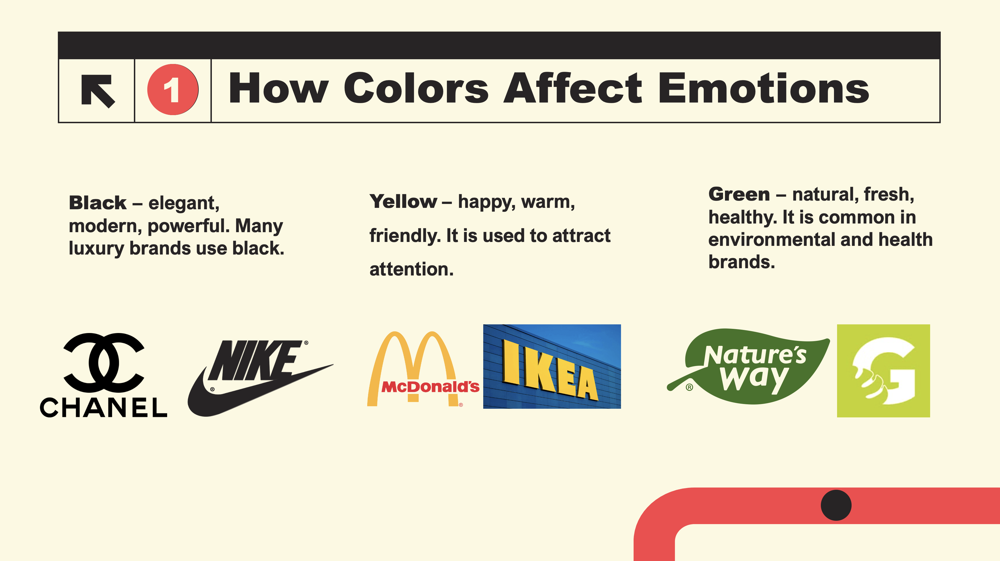

Colors create emotions, and designers choose them carefully.

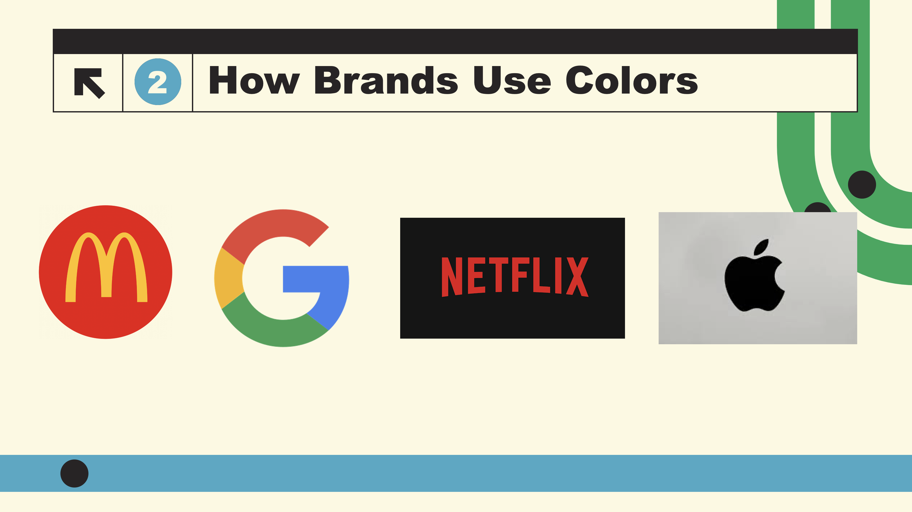

Companies use colors to create a strong brand identity. For example:
- **McDonald's** – red and yellow. Red makes people feel hungry, and yellow feels happy.
- **Google** – red, blue, green, and yellow. A playful and creative combination.
- **Netflix** – red and black. Red creates excitement, and black adds elegance.
- **Apple** – white and silver. These colors look modern, clean, and simple.

Color choices help brands send the right message to customers.

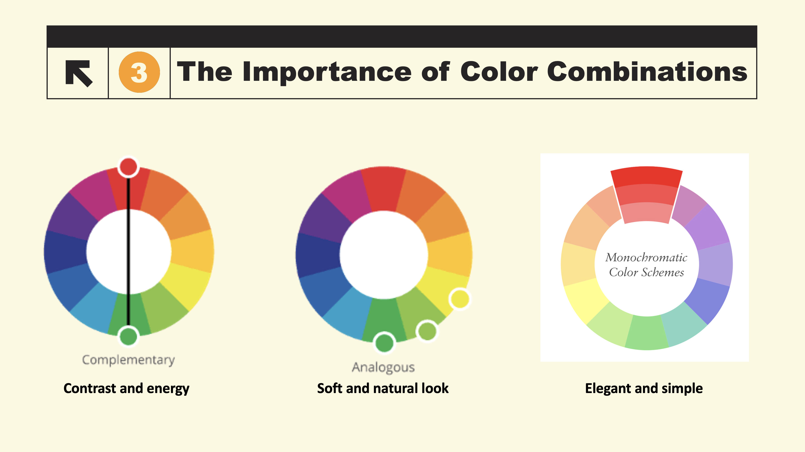

A good color combination makes a design look balanced and attractive. Designers use color theory to create harmony.

There are three main types of color combinations:

1. **Complementary Colors** – colors opposite each other on the color wheel. They create contrast and energy.
2. **Analogous Colors** – colors next to each other. They create a soft and natural look.
3. **Monochromatic Colors** – different shades of one color. This looks elegant and simple.

Choosing the right combination helps designers make beautiful and effective visuals.

Also the right combination of colors will not only help to attract potential customers, but also help the brand to stand out among competitors.

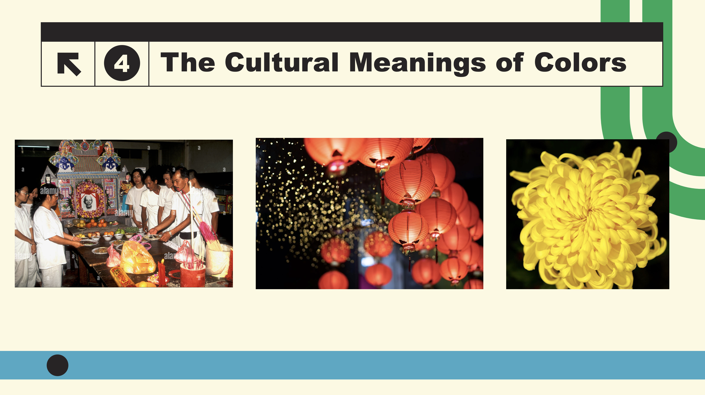

Cultural differences are important in design and branding. But you have to remember that colors do not always mean the same thing in every country.

- **White** – In Western cultures, white means purity and weddings. In some Asian countries, it represents mourning.
- **Red** – In China, red symbolizes luck and happiness, while in Western cultures, it can mean danger or love.
- **Yellow** – In Japan, yellow represents courage, but in Western cultures, it can mean happiness or caution.

Understanding the cultural meanings of colors is important for global design and marketing for example to avoid unwanted situations or to avoid creating dissonance in customers. They may have seen an interesting product, but because of the wrong color they may have different associations than the original meaning of the product 

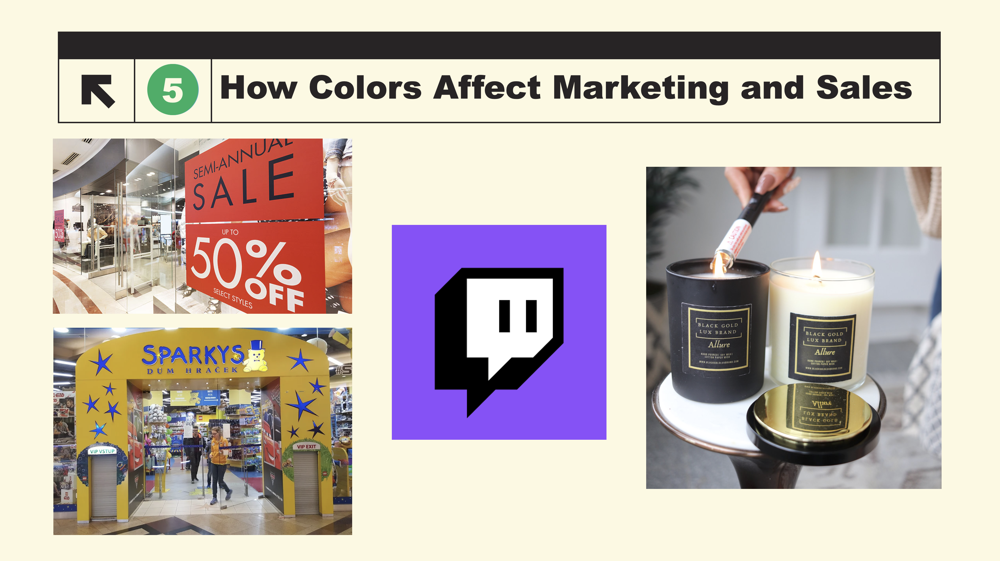

Colors play a big role in advertising and sales. They can influence customer behavior.

- **Red** – Increases heart rate and creates urgency. That’s why sales signs are often red.
- **Yellow:** Happiness and Attention

**Example:** Sparkys uses yellow and blue to create a welcoming and positive shopping experience.

- **Purple:** Creativity

**Example:** **Twitch** uses purple to feel creative and unique.

- **Black and gold** – Often used in luxury products to show sophistication.

Companies choose colors to make people feel a certain way and encourage them to buy.

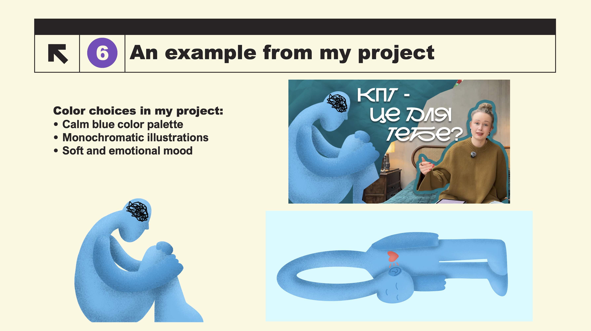

I want to show a small example from my own project.

I created a YouTube banner and video thumbnails for my friend’s psychology channel. I mainly used blue colors because blue creates a calm, peaceful, and trustworthy feeling. I think these emotions fit well with psychology content.

I also used monochromatic illustrations to make the design look simple, soft, and modern. The small red heart adds contrast and represents emotions and care.

I also tried to create simple illustrations that would make it easy to understand the meaning and the idea behind them.

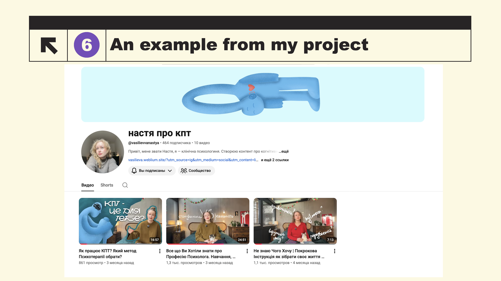

And this is what it looks like on her channel. I think if I design future video thumbnails in this style, it will help her attract more viewers to her channel.

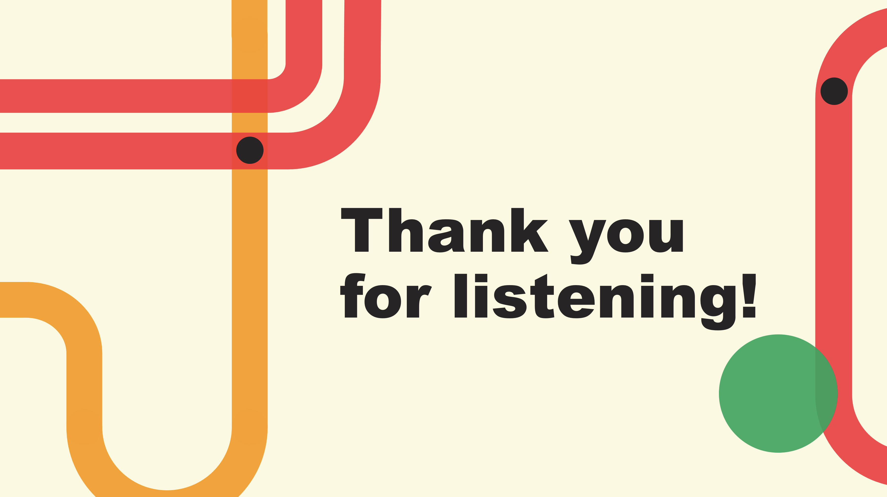
